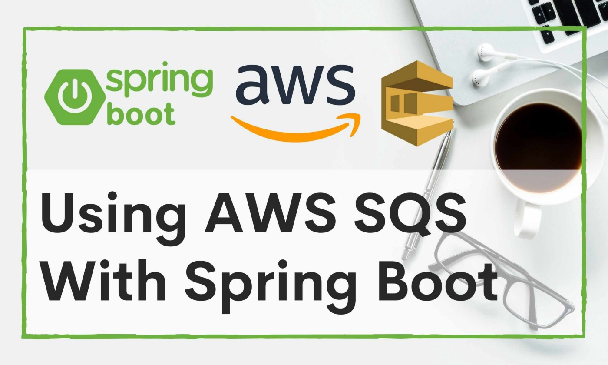
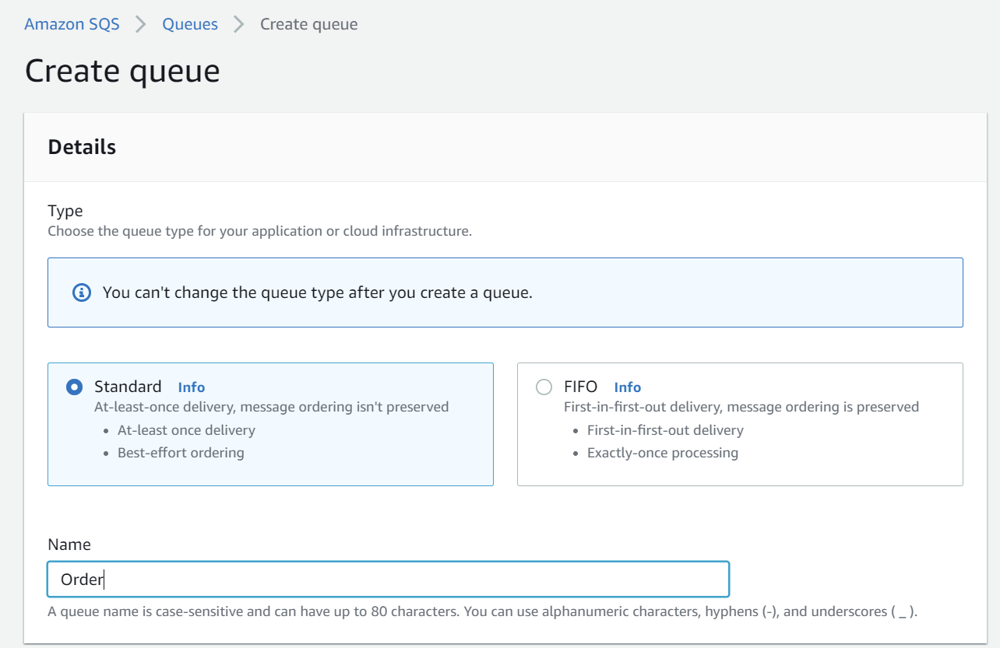
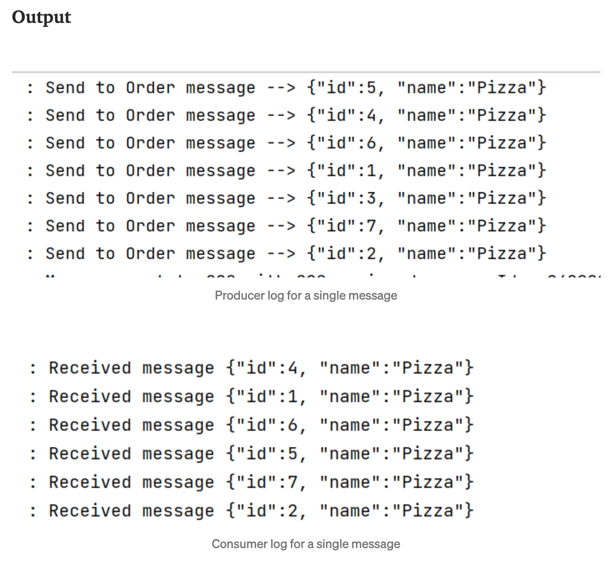
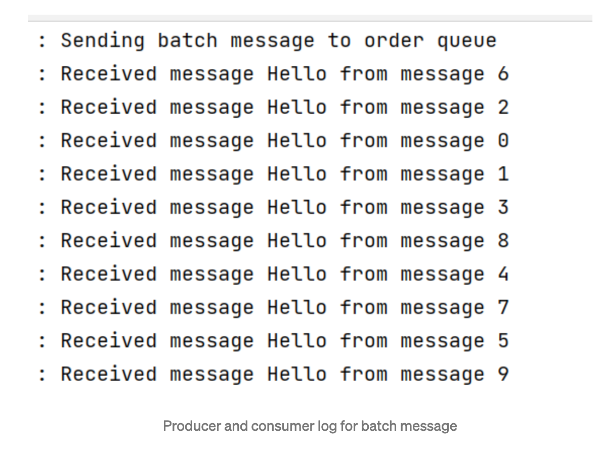

# How to Use AWS SQS With Sprint Boot

### First, let’s see some benefits of SQS.

1. We do not have to manage SQS. AWS will do all the management tasks.
2. Super-fast message delivery. But we can also configure delay if necessary.
3. DLQ (Dead Letter Queue) support. I will discuss DLQ shortly.
4. SQS will scale automatically based on the number of messages. There is no limitation of messages per queue.
5. SQS is cost-effective. No capacity planning is necessary. Calculations are based on usage.

### Use Cases

1. Decoupling microservices: In a big architecture, we may have many microservices. Communication between microservices
   is really complex. It would be great if we could decouple the microservices. So, they do not have to depend on each
   other. SQS can be used for this case. One service can publish the data to a queue, and other services can pull that
   data and process them. It is super-fast so that it will feel like real-time. Also, a long chain of processing can be
   simplified using SQS. With proper state management, we will know which state is causing the failure. For example, a
   restaurant management system can receive the order from customers. The order can be pushed to an SQS queue, and the
   processing service can pick it up. After preparing the order, the processing service can push the order id to the
   serving queue. The serving queue then shows that order id in the display. No service has to depend on any other
   service.
2. Trigger background (async) event: Not all events require real-time response. Some might trigger background events
   too. Like if users buy anything online, that might trigger an event to update the inventory. Updating inventory may
   take time, and users don't need to wait until the inventory is updated. Instead, we can push it to SQS and let other
   services handle the remaining processing. This is just one background example. There can be thousands.

### Queue Types

1. Standard Queue This is super-fast, unlimited TPS, guaranteed at-least-once delivery, but not ordering.
2. FIFO Queue:
   It can process 300 messages per second. But it can be increased. It guarantees exactly-once processing. And also
   maintains orders.

### Terminology

1. Payload: Payload is the message content. The message size can be a maximum of 256KB. AWS will bill us for each 64KB.
   So, a 256KB payload will be billed 4 times.
2. Long polling: Enabling Long polling will reduce SQS costs. If there is no message in the queue, SQS will wait for a
   maximum of 20s until a message arrives. This will allow reducing empty responses.
3. Dead Letter Queues (DLQ): If our queue could not process any request, it will push the messages to DLQ if configured.
   DLQ is just another SQS queue. It is helpful to have a DLQ set up to easily investigate why we never receive some
   requests or why the requests failed.

### Integrating AWS SQS with Spring Boot

Create SQS Queue


Config SQS Queue


First, I will create a queue in SQS. Initially, I will select queue type. This type cannot be changed after creation. I
am selecting the standard type. The queue name is Order.

Visibility timeout: This is when the message will be hidden from other consumers if the client does not delete the
message.

Delivery delay: This is when the message will be hidden from consumers after the message is pushed to the queue.

Receive message wait time: This is for long polling.

Message retention period: Message will be deleted automatically after a time.

Maximum message size: Max size of the payload.

After creating the queue, I will add maven dependencies in pom.xml

```xml
<dependency>
    <groupId>org.springframework</groupId>
    <artifactId>spring-jms</artifactId>
</dependency>
<dependency>
    <groupId>com.amazonaws</groupId>
    <artifactId>aws-java-sdk</artifactId>
    <version>1.12.70</version>
</dependency>
<dependency>
    <groupId>com.amazonaws</groupId>
    <artifactId>amazon-sqs-java-messaging-lib</artifactId>
    <version>1.0.8</version>
    <type>jar</type>
</dependency>
```

### Client configuration

```java
@Service
public class AmazonSqsClient {

  private AmazonSQS client;

  @PostConstruct
  private void initializeAmazonSqsClient() {
    this.client =
        AmazonSQSClientBuilder.standard()
            .withCredentials(getAwsCredentialProvider())
            .withRegion(Region.getRegion(Regions.AP_SOUTHEAST_1).getName())
            .build();
  }

  private AWSCredentialsProvider getAwsCredentialProvider() {
    AWSCredentials awsCredentials = new BasicAWSCredentials("access-key", "secret-key");
    return new AWSStaticCredentialsProvider(awsCredentials);
  }

  public AmazonSQS getClient() {
    return client;
  }
}
```

I will configure the SQS client, so my application can communicate with the queue.

JMS configuration

```java
@Configuration
@EnableJms
public class JmsConfig {

  @Autowired AmazonSqsClient amazonSQSClient;
  private SQSConnectionFactory connectionFactory;

  @PostConstruct
  public void init() {
    ProviderConfiguration providerConfiguration = new ProviderConfiguration();
    connectionFactory =
        new SQSConnectionFactory(providerConfiguration, amazonSQSClient.getClient());
  }

  @Bean
  public DefaultJmsListenerContainerFactory jmsListenerContainerFactory() {
    DefaultJmsListenerContainerFactory factory = new DefaultJmsListenerContainerFactory();
    factory.setConnectionFactory(this.connectionFactory);
    factory.setDestinationResolver(new DynamicDestinationResolver());
    factory.setConcurrency("3-10");
    factory.setSessionAcknowledgeMode(Session.CLIENT_ACKNOWLEDGE);
    return factory;
  }

  @Bean
  public JmsTemplate defaultJmsTemplate() {
    return new JmsTemplate(this.connectionFactory);
  }
}
```

The consumer will have @JmsListene annotation. It will pull messages from the queue. Inside the process method, we can
add any code to process this message.

```java
@JmsListener(destination = "${queue.order}")
public void process(String data) {
  LOG.info("Received message " + data);
}
```

The producer can send a single message or batch message.

```java
@Autowired private JmsTemplate defaultJmsTemplate;

@Autowired AmazonSqsClient amazonSQSClient;

public void send(String queueName, String requestBody) {
  LOG.info("Send to {} message --> {}", queueName, requestBody);
  defaultJmsTemplate.convertAndSend(queueName, requestBody);
}public void sendMultiple() {
  SendMessageBatchRequestEntry[] dataArray = new SendMessageBatchRequestEntry[10];
  for (int i = 0; i < 10; i++) {
    dataArray[i] =
        new SendMessageBatchRequestEntry(UUID.randomUUID().toString(), "Hello from message " + i);
  }

  LOG.info("Sending batch message to order queue");

  SendMessageBatchRequest sendBatchRequest =
      new SendMessageBatchRequest()
          .withQueueUrl("queue-url")
          .withEntries(dataArray);
  amazonSQSClient.getClient().sendMessageBatch(sendBatchRequest);
}
```

A batch message will save cost and time.

Output




